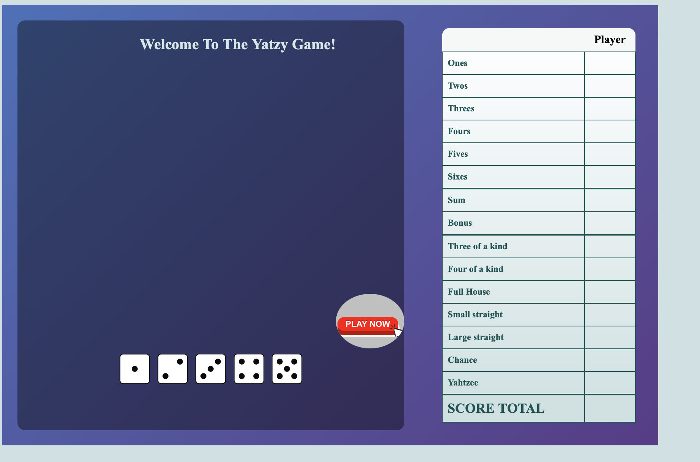
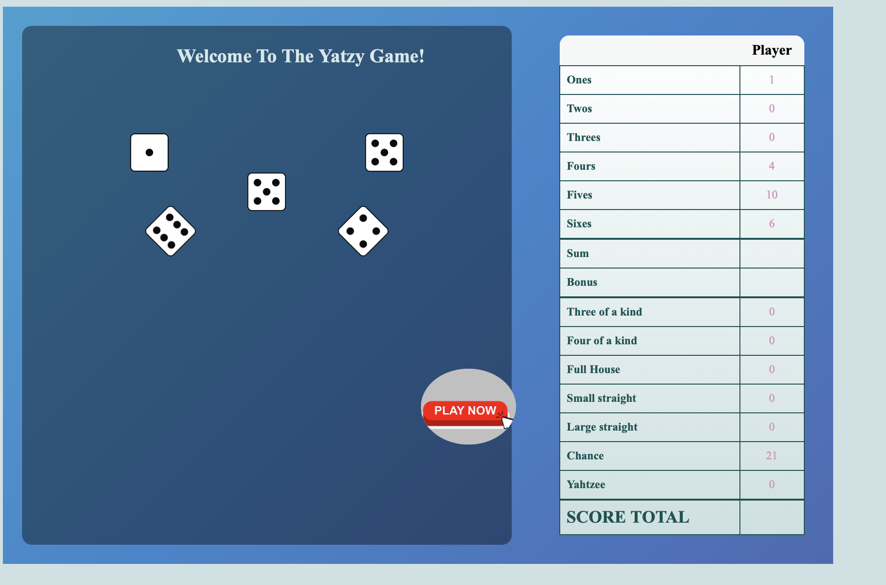
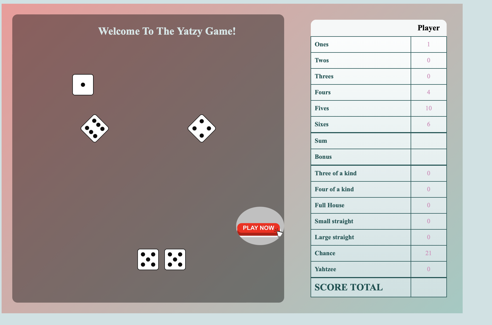
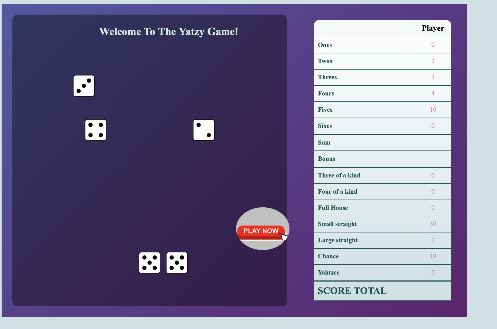
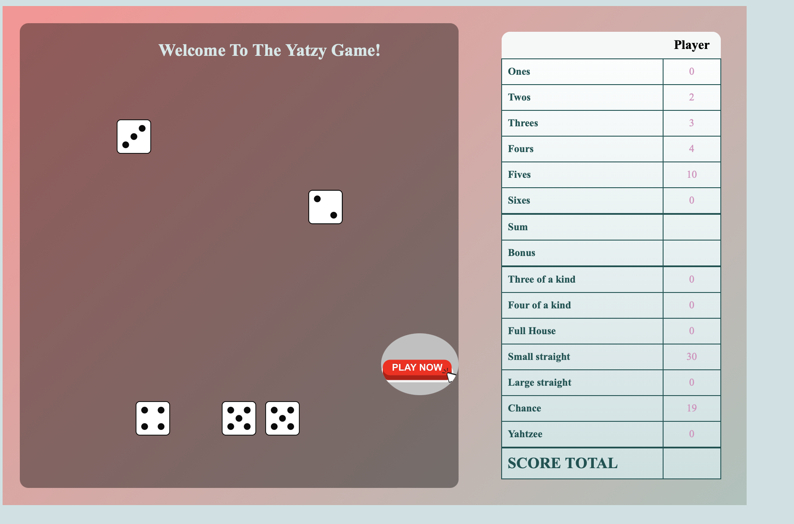
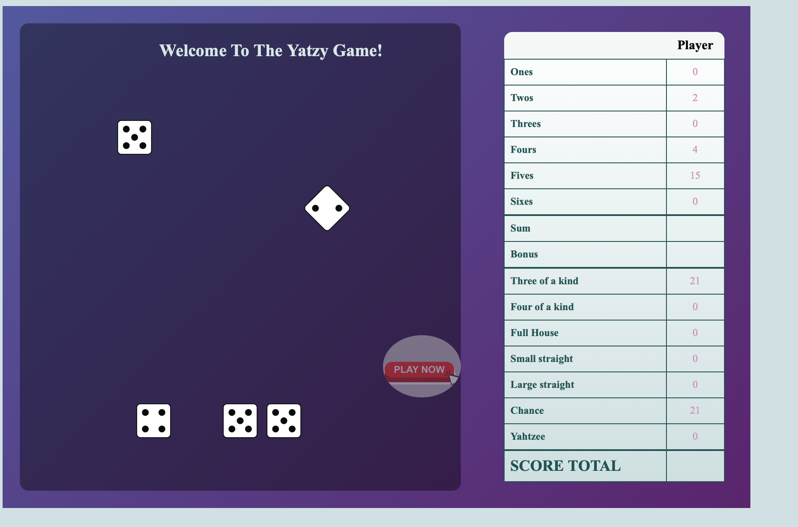
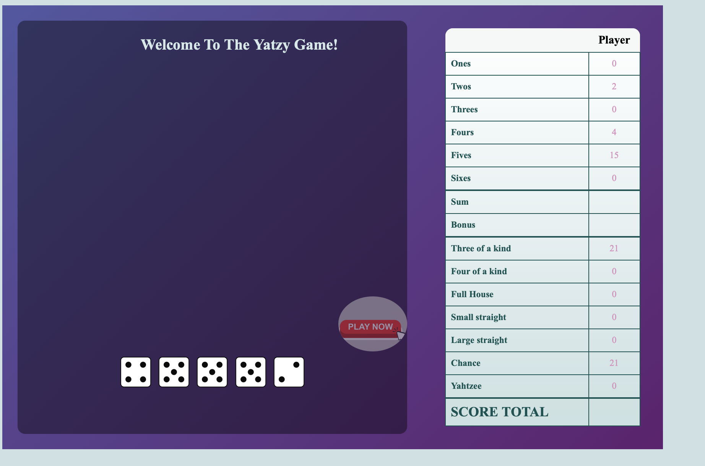
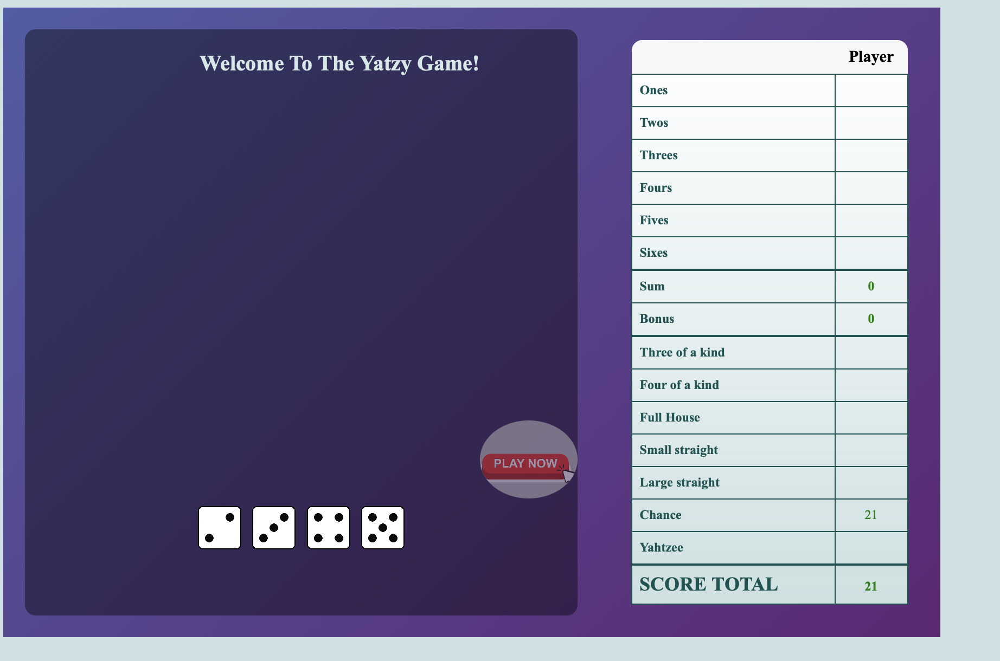

**Description et instructions du jeu:** 
---
 

Le joueur lance les cinq dés pour obtenir un motif (c'est-à-dire une disposition particulière des dés) qui rapporte des points. Il a droit à trois lancers de dés par tour. Après chaque lancer, il peut choisir de mettre de côté certains de ces dés et de relancer les autres.
 
 

Après un maximum de trois lancers, le joueur doit choisir entre marquer une figure pour laquelle il remplit les conditions ou rayer une figure.  Nous avons les figures:
 

1-> dans laquelle, la condition est d’obtenir un maximum de dés de face1; on calcule ensuite la somme des  dés de face1 et le score maximum doit etre de 5 points;
 

2-> dans laquelle, la condition est d’obtenir un maximum de dés de face2; on calcule ensuite la somme des  dés de face2 et le score maximum doit etre de 10 points;
 

3-> dans laquelle, la condition est d’obtenir un maximum de dés de face3; on calcule ensuite la somme des  dés de face3 et le score maximum doit etre de 15 points;
 

4-> dans laquelle, la condition est d’obtenir un maximum de dés de face4; on calcule ensuite la somme des  dés de face4 et le score maximum doit etre de 20 points;
 

5-> dans laquelle, la condition est d’obtenir un maximum de dés de face5; on calcule ensuite la somme des  dés de face5 et le score maximum doit etre de 25 points;
 

6-> dans laquelle, la condition est d’obtenir un maximum de dés de face6; on calcule ensuite la somme des  dés de face6 et le score maximum doit etre de 30 points;
 

Brelan ou Three of a kind-> dans laquelle, la condition est d’obtenir trois dés de même valeur; on calcule ensuite la somme des trois dés identiques et le score maximum doit etre de 18 points;
 

Carré ou Four of a kind-> dans laquelle, la condition est d’obtenir quatre dés de même valeur; on calcule ensuite la somme des quatre dés identiques et le score maximum doit etre de 24 points;
 

Full House-> dans laquelle, la condition est d’obtenir un brelan et deux dés de même valeur; score maximum doit etre de 25 points;
 

Petite suite ou Small straight-> dans laquelle, la condition est d’obtenir une suite croissante de quatre dés; score maximum doit etre de 30 points;
 

Grande suite ou Large straight-> dans laquelle, la condition est d’obtenir une suite croissante de cinq dés; score maximum doit etre de 40 points;
 

Yatzee-> dans laquelle, la condition est d’obtenir cinq dés de même valeur; score maximum doit etre de 50 points;
 

Chance-> dans laquelle, la condition qu'il n'y a aucune condition et le score maximum est de 30 points.
  

Ci-dessous se trouve un exemple en images: 
 

